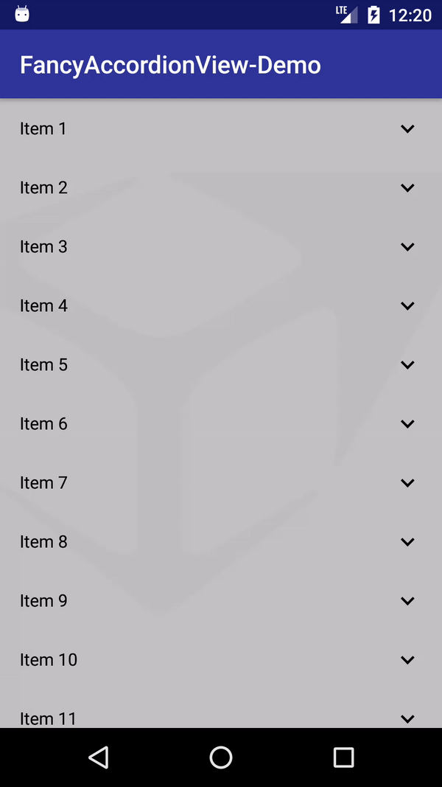

# FancyAccordionView
An Android fancy accordion view,

## 1. Demo
To run the example demo, clone the repo, import the project in Android Studio and run the app.



## 2. What is FancyAccordionView?
FancyAccordionView is a custom view that can be used for showing a list of items. It extends RecyclerView and offers the following features:
* allows you to expand and collapse each item
* allows custom layout for extended/collapsed item
* callback for extended/collapsed item click
* scroll up the clicked item

## 3. How to use it?
To use the FancyAccordionView in your project follow this steps.

### 3.1 Add the library as a dependency
1. in **Project level `build.gradle`** add this repository
```gradle
   maven { url  'https://dl.bintray.com/sysdata/maven' }
```
2. in your **App level `build.gradle`** add this dependecy
```gradle
    implementation 'it.sysdata.mobile:sddialogview:1.0.0'
```

### 3.2 Add FancyAccordionView to your layout 
Open your layout file and add the FancyAccordionView:

    <com.sysdata.widget.accordion.FancyAccordionView
            android:id="@+id/fancy_accordion_view"
            android:layout_width="match_parent"
            android:layout_height="match_parent"
            android:clipToPadding="false"
            android:descendantFocusability="beforeDescendants"
            android:fadingEdgeLength="0dp"
            android:scrollbarStyle="outsideOverlay"
            android:scrollbars="vertical"
            android:splitMotionEvents="false"
            tools:listitem="@layout/sample_layout_collapsed"/>
#### 3.3 Create your custom layout for collapsed and expanded item
Create your custom layout for collapsed and expanded item.

Example for collapsed item **sample_layout_collapsed**:

    <RelativeLayout
        xmlns:android="http://schemas.android.com/apk/res/android"
        xmlns:app="http://schemas.android.com/apk/res-auto"
        xmlns:tools="http://schemas.android.com/tools"
        android:layout_width="match_parent"
        android:layout_height="wrap_content"
        android:background="?attr/selectableItemBackground"
        android:paddingEnd="16dp"
        android:paddingStart="16dp">
        
        <TextView
            android:id="@+id/sample_layout_collapsed_title"
            android:layout_width="match_parent"
            android:layout_height="48dp"
            android:layout_alignParentStart="true"
            android:gravity="center_vertical"
            android:textColor="@android:color/black"
            tools:text="Collapsed View"/>
            
        <com.sysdata.widget.accordion.ArrowImageView
            android:layout_width="wrap_content"
            android:layout_height="48dp"
            android:layout_alignParentRight="true"
            android:tint="@android:color/black"
            app:expanded="false"/>
            
    </RelativeLayout>

Example for expanded item **sample_layout_expanded**:

    <RelativeLayout
        xmlns:android="http://schemas.android.com/apk/res/android"
        xmlns:app="http://schemas.android.com/apk/res-auto"
        xmlns:tools="http://schemas.android.com/tools"
        android:layout_width="match_parent"
        android:layout_height="wrap_content"
        android:background="?attr/selectableItemBackground"
        android:paddingEnd="16dp"
        android:paddingStart="16dp">
    
        <TextView
            android:id="@+id/sample_layout_expanded_title"
            android:layout_width="match_parent"
            android:layout_height="48dp"
            android:layout_alignParentStart="true"
            android:gravity="center_vertical"
            android:textColor="@android:color/black"
            tools:text="Expanded View"/>
    
        <TextView
            android:id="@+id/sample_layout_expanded_description"
            android:layout_width="match_parent"
            android:layout_height="wrap_content"
            android:layout_alignParentStart="true"
            android:layout_below="@+id/sample_layout_expanded_title"
            android:gravity="top"
            android:minHeight="48dp"
            android:paddingBottom="8dp"
            tools:text="I'm an Expanded View"/>
    
        <com.sysdata.widget.accordion.ArrowImageView
            android:layout_width="wrap_content"
            android:layout_height="48dp"
            android:layout_alignParentRight="true"
            android:tint="@android:color/black"
            app:expanded="true"/>
    
    </RelativeLayout>

#### 3.4 Create your custom listener for item click
Create your custom listener for item click, for example:

    private ItemAdapter.OnItemClickedListener mListener = new ItemAdapter.OnItemClickedListener() {
        @Override
        public void onItemClicked(ItemAdapter.ItemViewHolder<?> viewHolder, int id) {
            ItemAdapter.ItemHolder itemHolder = viewHolder.getItemHolder();
            SampleItem item = ((SampleItem) itemHolder.item);

            switch (id) {
                case ItemAdapter.OnItemClickedListener.ACTION_ID_COLLAPSED_VIEW:
                    showToast(String.format("Collapsed %s clicked!", item.getTitle()));
                    break;
                case ItemAdapter.OnItemClickedListener.ACTION_ID_EXPANDED_VIEW:
                    showToast(String.format("Expanded %s clicked!", item.getTitle()));
                    break;
                default:
                    // do nothing
                    break;
            }
        }
    };
 
#### 3.5 Initialize the FancyAccordionView
Get the reference to FancyAccordionView, set the layout for collapsed/expanded item, set the listener for item click and load your data into list.

    FancyAccordionView mRecyclerView = (FancyAccordionView) findViewById(R.id.alarms_recycler_view);
    
    // bind the factory to create view holder for item collapsed
    mRecyclerView.setCollapsedViewHolderFactory(SampleCollapsedViewHolder.Factory.create(R.layout.sample_layout_collapsed), mListener);

    // bind the factory to create view holder for item expanded
    mRecyclerView.setExpandedViewHolderFactory(SampleExpandedViewHolder.Factory.create(R.layout.sample_layout_expanded), mListener);

    // restore the expanded item from state
    if (savedInstanceState != null) {
        mRecyclerView.setExpandedItemId(savedInstanceState.getLong(KEY_EXPANDED_ID, Item.INVALID_ID));
    }

    // populate RecyclerView with mock data
    loadData();

# Licence

      Copyright (C) 2017 Sysdata S.p.A.

      Licensed under the Apache License, Version 2.0 (the "License");
      you may not use this file except in compliance with the License.
      You may obtain a copy of the License at

          http://www.apache.org/licenses/LICENSE-2.0

      Unless required by applicable law or agreed to in writing, software
      distributed under the License is distributed on an "AS IS" BASIS,
      WITHOUT WARRANTIES OR CONDITIONS OF ANY KIND, either express or implied.
      See the License for the specific language governing permissions and
      limitations under the License.
